# 从 API 到 CLI 到 Skills：ClawShire 如何把上市公司数据平台变成 Agent-friendly 工具链

> 这篇文章受 AppleBOY 的《The Next Step for AI Agents: API + CLI + Skills Architecture》启发。原文提出了一个很实用的判断：要让产品被 AI Agent 稳定使用，不一定先做一个复杂的 AI 功能，也不一定马上做 MCP Server；更可落地的路径是先把能力沉淀成 **API → CLI → Skills** 三层。
>
> ClawShire 的业务场景刚好验证了这条路径：上市公司公告、年报、结构化数据和财报分析本来就需要稳定的 API；人和脚本需要可调试的 CLI；Agent 则需要一套能读懂、能执行、能纠错的 Skills。

## 一句话结论

如果把产品能力直接交给 Agent 调用 API，Agent 会被认证、分页、错误码、字段含义、任务状态、文件路径这些细节拖住。

更稳定的做法是：

```mermaid
flowchart LR
    User["用户自然语言需求<br/>查公告 / 找年报 / 分析财报"] --> Agent["AI Agent"]
    Agent --> Skill["ClawShire Skills<br/>场景规则 + 决策树 + 输出约定"]
    Skill --> CLI["clawshire CLI<br/>确定性命令 + JSON 输出 + 退出码"]
    CLI --> API["ClawShire API<br/>公告 / 年报 / 分析任务"]
    API --> Data["上市公司数据资产<br/>公告 PDF / 结构化字段 / 分析报告"]
    Data --> API --> CLI --> Skill --> Agent --> User

    classDef user fill:#fff7ed,stroke:#f97316,color:#7c2d12;
    classDef agent fill:#eef2ff,stroke:#6366f1,color:#312e81;
    classDef skill fill:#ecfdf5,stroke:#10b981,color:#064e3b;
    classDef cli fill:#f8fafc,stroke:#475569,color:#0f172a;
    classDef api fill:#eff6ff,stroke:#2563eb,color:#1e3a8a;
    classDef data fill:#fefce8,stroke:#ca8a04,color:#713f12;
    class User user;
    class Agent agent;
    class Skill skill;
    class CLI cli;
    class API api;
    class Data data;
```

API 是能力底座，CLI 是确定性桥接层，Skills 是 Agent 的业务操作手册。

## 下一步技术待办

这套三层结构已经在 `clawshire-cli` 里成立，但后续如果要继续提升 Agent 适配性，重点不在“把更多逻辑塞进 Skill”，而在补工程分层和同步机制。

可直接参考：

- [`anthropic-financial-services-lessons.md`](./anthropic-financial-services-lessons.md)

其中重点包括：

1. 为高频 workflow 补显式 `commands` 层
2. 为未来 agent bundle 引入 `skill drift check`
3. 为 connector / MCP 层预留扩展位，而不是把集成逻辑塞进 skill

## 为什么不是让 Agent 直接调 API？

在 ClawShire 里，API 能力本身已经很完整：公告查询、年报列表、年报结构化数据、年报分析任务都可以通过服务端完成。但 Agent 直接调 API 会遇到几个问题：

| 问题 | 直接 API 调用的成本 | CLI + Skill 的处理方式 |
|------|---------------------|-------------------------|
| 认证 | Agent 要理解 Header、Key 来源、过期状态 | `clawshire auth status/check` 给出明确状态 |
| 参数 | 日期、证券代码、PDF 链接、`met_uuid` 容易混用 | Skill 先做路由，再选择命令 |
| 分页 | Agent 容易一次拉太多或漏拉 | CLI 默认控制 `page-size`，Skill 规定何时用全量 |
| 错误 | HTTP 错误和业务错误混在一起 | CLI 用退出码、stderr、JSON 错误结构暴露 |
| 任务 | 年报分析是异步任务，需要轮询 | Skill 记录 `task_id/job_id` 和下一步命令 |
| 输出 | API 字段多，用户只关心结论 | Skill 规定用户态摘要和脚本态 JSON |

也就是说，API 是给程序用的，CLI 是给人和脚本用的，Skill 是给 Agent 用的。三层不是重复建设，而是在不同边界上降低摩擦。

## ClawShire 的三层架构

ClawShire 不是一个简单的“查接口”工具。它面对的是上市公司信息披露场景，典型任务往往是链式的：

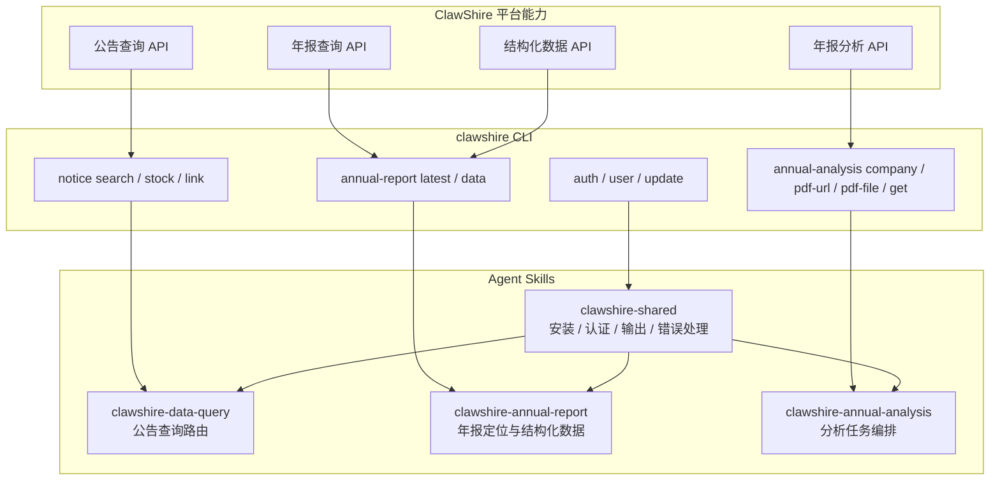

这套结构的关键不是“多写几份文档”，而是每一层只解决自己该解决的问题。

| 层级 | ClawShire 中的体现 | 主要职责 |
|------|--------------------|----------|
| API | `https://api.clawshire.cn` 后端服务 | 暴露数据和任务能力，保证服务端权限、配额、计费、分析逻辑一致 |
| SDK | `clawshire_sdk` | 给 Python 程序稳定调用域模型，复用 API 封装 |
| CLI | `clawshire` / `cs` | 给终端、人、脚本和 Agent 一个确定性执行入口 |
| Skills | `skills/clawshire-*` | 把命令组合成可执行的业务流程，告诉 Agent 何时用哪个命令 |

## CLI 为什么是中间的关键层？

原文强调 CLI 是 API 和 Agent 之间最现实的桥接层。放在 ClawShire 里看，这个判断更明显。

### 1. CLI 有确定性的执行闭环

一次命令执行天然包含三件事：输入参数、标准输出、退出码。

```bash
clawshire annual-report latest --year 2025 --keyword 平安银行 --page-size 3 --format json
```

Agent 拿到结果后可以明确判断：

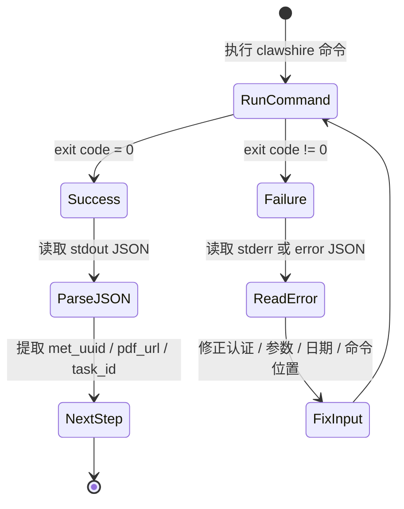

这比“让 Agent 自己拼 HTTP 请求，再猜哪里错了”稳定得多。

### 2. CLI 对 Agent 是零集成成本

Agent 不需要接入 SDK，不需要加载 OpenAPI Schema，也不需要先启动一个专门的服务。它只要能运行命令，就可以先从帮助信息发现能力：

```bash
clawshire --help
clawshire notice --help
clawshire annual-report --help
clawshire annual-analysis --help
```

更重要的是，CLI 可以直接约束输出：

```bash
clawshire notice stock 603402 --start-date 2026-04-01 --end-date 2026-04-20 --page-size 5 --format json
```

对 Agent 来说，`--format json` 是一个很重要的稳定接口。它避免了从人类友好的表格或自然语言里反向解析字段。

### 3. CLI 同时连接本地和远端

ClawShire 的年报分析入口有三种：

```bash
clawshire annual-analysis company 000001 --year 2025
clawshire annual-analysis pdf-url https://static.cninfo.com.cn/finalpage/2026-04-20/1225116956.PDF
clawshire annual-analysis pdf-file ./report.pdf
```

这里同时出现了远端数据、本地文件、用户输入和服务端异步任务。纯 API 当然也能做，但 Agent 需要额外处理文件上传、路径、URL 可访问性、任务状态等细节。CLI 把这些差异收敛成几个命令入口，Skill 再告诉 Agent 该如何选择。

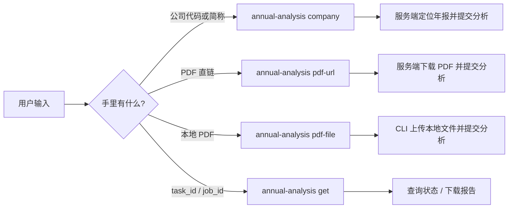

## Skills 不是命令说明书，而是业务决策树

很多人第一次写 Skill 时容易把它写成“CLI README 的缩写版”。这不够。README 解决的是“有哪些命令”，Skill 解决的是“Agent 在某个用户意图下应该怎么走”。

ClawShire 现在把 Skills 分成四类：

```text
skills/
├── clawshire-shared/
│   └── SKILL.md               # 安装、认证、输出格式、错误处理
├── clawshire-data-query/
│   └── SKILL.md               # 公告查询：日期、证券代码、PDF 链接路由
├── clawshire-annual-report/
│   └── SKILL.md               # 年报定位、met_uuid、结构化数据
└── clawshire-annual-analysis/
    └── SKILL.md               # 分析提交、任务查询、报告下载
```

每个 Skill 里最重要的部分是 Agent Invariants，也就是不能违反的操作原则。

例如公告查询场景：

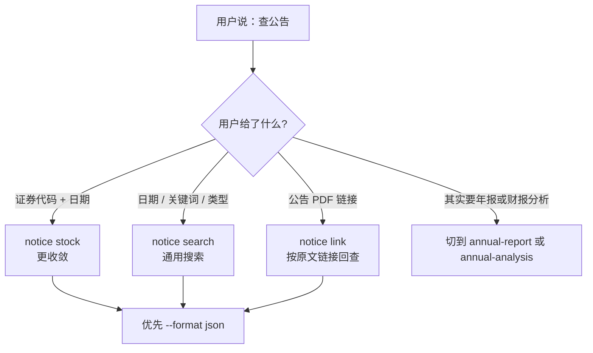

年报查询场景：

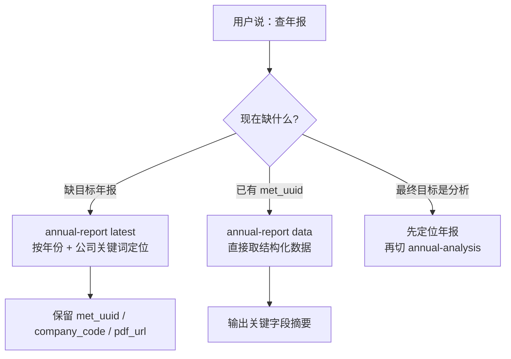

年报分析场景：

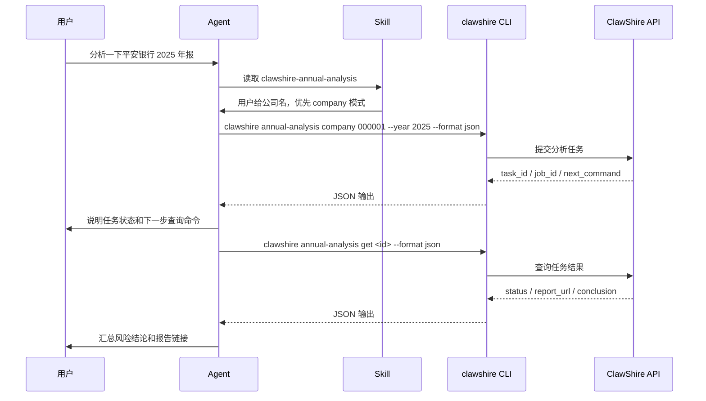

这就是 Skill 的价值：它不是替代 CLI，而是把“如何使用 CLI 完成业务目标”写成 Agent 可执行的知识。

## 一个完整场景：从自然语言到财报分析

假设用户只说了一句：

> 帮我看一下平安银行 2025 年报，有没有明显风险。

如果没有 Skills，Agent 需要自己判断：公司代码是什么、年报在哪里、是否需要查公告、PDF 链接是否可用、分析任务怎么提交、任务完成后怎么取报告。

有了 ClawShire Skills，链路会变成：

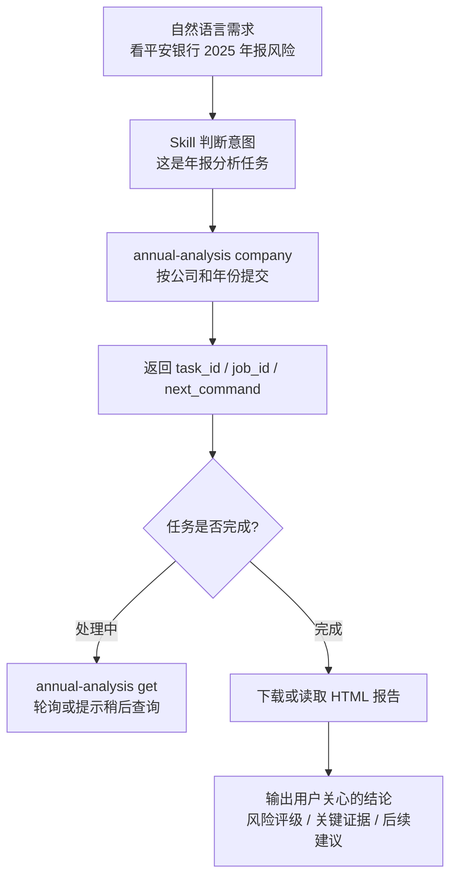

对应命令非常短：

```bash
clawshire annual-analysis company 000001 --year 2025 --format json
clawshire annual-analysis get <task_id_or_job_id> --format json
```

这背后并不是 Agent 变聪明了，而是工具链把不稳定性逐层消化掉了：

| 阶段 | 谁负责稳定性 | 消化了什么复杂度 |
|------|--------------|------------------|
| API | 服务端 | 数据权限、任务执行、配额、分析规则 |
| CLI | 命令行工具 | 参数、认证、输出格式、退出码 |
| Skill | Agent 知识层 | 意图路由、命令组合、错误恢复、用户摘要 |

## 真实踩坑：Agent 环境会暴露 CLI 设计问题

在人手动使用 CLI 时，很多问题不会立即暴露；但 Agent 会把它们放大。

我们遇到过一个典型问题：用户终端里 `cs user info` 可以正常工作，但 Agent 环境里调用 `clawshire annual-report latest` 返回 401。

排查路径大概是：

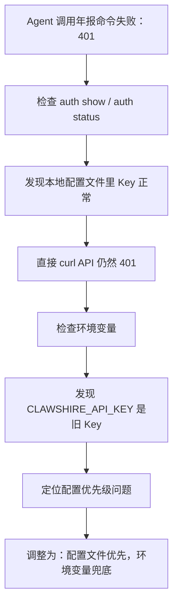

这个问题说明了一件事：Agent-friendly CLI 不能只追求“人能跑通”。它还要适应 Agent 的执行环境，比如：

| 设计点 | 为什么对 Agent 重要 |
|--------|---------------------|
| 明确的认证状态命令 | Agent 需要知道问题是没登录、Key 错、还是服务端拒绝 |
| 稳定的配置优先级 | Agent 环境变量可能和用户终端不同 |
| JSON 输出 | Agent 不应该解析彩色表格或提示语 |
| 非交互模式 | Agent 不能卡在确认提示里 |
| 可复制的 next command | 异步任务必须告诉 Agent 下一步怎么查 |

## MCP 要不要做？

原文里有一个很务实的观点：不要一开始就急着做 MCP Server。这个判断不等于否定 MCP，而是强调投入顺序。

对 ClawShire 这类数据平台来说，更合理的顺序是：

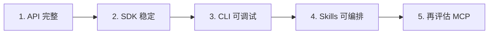

原因很简单：

| 方案 | 适合阶段 | 优点 | 代价 |
|------|----------|------|------|
| API | 产品底座 | 所有客户端复用 | 对 Agent 不够友好 |
| CLI | 早期到成熟期 | 低集成成本、可调试、可脚本化 | 需要设计好输出和错误 |
| Skills | Agent 接入期 | 快速把业务经验交给 Agent | 需要持续维护工作流规则 |
| MCP | 深度集成期 | 工具发现和结构化调用更标准 | 部署、权限、客户端兼容成本更高 |

当 CLI 和 Skills 已经稳定后，再做 MCP 会更顺：MCP 的工具定义可以复用 CLI 的命令语义，错误处理也可以参考已有 Skill 的决策树。

## ClawShire 的 Agent-friendly 设计清单

如果要把 ClawShire 继续打磨成更适合 Agent 使用的数据工具链，可以按这份清单推进。

### CLI 层

- 所有核心命令都支持 `--format json`。
- 展示格式参数放在具体命令后，例如 `clawshire user info --format json`。
- 异步任务返回 `task_id`、`job_id`、`status` 和 `next_command`。
- 高风险或消耗额度的操作默认让 Skill 判断意图，不让 Agent 误触发。
- 错误信息尽量结构化，至少保证 stderr 能指导下一步。

### Skill 层

- 每个 Skill 都要有 Agent Invariants，而不只是命令列表。
- `clawshire-shared` 统一安装、认证、输出格式和错误处理。
- 场景 Skill 只负责编排，不重复实现 HTTP 请求。
- 多结果时要求 Agent 解释命中原因，并建议缩小年份、公司名或证券代码。
- 面向用户输出摘要，面向脚本保留 `met_uuid`、`pdf_url`、`task_id` 等关键字段。

### 产品层

- API 继续保持服务端权限、配额、计费和分析逻辑的单一真源。
- CLI、SDK、Skills 跟随同一个仓库版本化，避免文档和实现分叉。
- 对公告、年报、分析报告这些核心对象建立稳定 ID。
- 对任务型能力提供可恢复查询，而不是只返回一次性结果。

## 结语

API + CLI + Skills 不是一个新协议，也不是某个厂商绑定的框架。它更像是一条务实的产品工程路线：

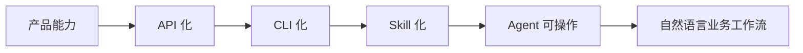

对 ClawShire 来说，这条路线的意义很直接：用户不需要记住公告接口、年报字段、任务状态和 PDF 链接规则，只要说“查一下这家公司最近公告”“帮我找 2025 年报”“分析一下这份年报风险”，Agent 就能沿着 Skills 调用 CLI，再由 CLI 调 API，最后把结构化数据和分析结论带回来。

真正重要的不是“我们给产品加了 AI”，而是“我们的产品已经能被 AI Agent 稳定、可控、可审计地使用”。

这才是上市公司数据平台进入 Agent 时代的基础设施。
